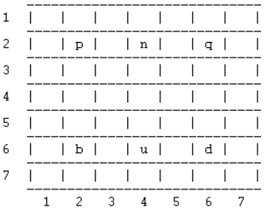
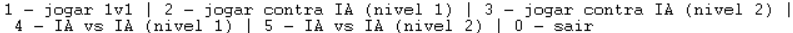

# Shakti: Primeiro Trabalho prático de PFL 2023

## Tópico e Grupo

O jogo de tabuleiro implementado no trabalho prático a que este documento diz respeito é o Shakti.

O identificador do grupo é _Shakti\_4_ e o mesmo é composto pelos seguintes estudantes, sendo apresentada, para cada um, a sua contribuição no desenvolvimento do trabalho:

- Pedro de Almeida Lima, nº mecanográfico 202108806, contribuição de 50%
- Pedro Simão Januário Vieira, nº mecanográfico 202108768, contribuição de 50%

## Instalação e Execução

Para executar o jogo, basta importar o ficheiro ```src/main.pl``` no terminal SICStus.
Para jogar, executar ```play.```. Deparar-se-á com um conjunto de opções de jogo.
Deve ser colocado um ponto (.) no final de cada _input_ fornecido.

## Descrição do Jogo

Shakti é um jogo de tabuleiro estratégico. É uma variante do xadrez jogada num tabuleiro de 7x7 casas. Ambas as equipas dispõem de um Rei e dois Guerreiros.

A particularidade que mais diferencia o Shakti do xadrez é que durante o seu decorrer, como consequência de certos movimentos, algumas posições do tabuleiro são invalidadas, o que reduz, progressivamente, a área de jogo disponível.

Algo importante para o desenrolar do jogo é a captura de peças: uma peça é capturada ("comida") quando uma peça adversária é movida para a posição em que a primeira se encontra.

### Objetivo

O objetivo do Shakti é vencer o oponente capturando o seu Rei, ao mesmo tempo que se protege o próprio monarca. Para isso, o jogador, tal como acontece no xadrez, tem de colocar o adversário na situação de "xeque-mate", onde o Rei deste não dispõe de nenhum movimento legal para escapar à captura.

### Movimentos Permitidos

- O rei pode mover-se em qualquer direção e sentido, uma casa de cada vez.
- Os guerreiros podem mover-se em qualquer direção, uma ou duas casas de cada vez. 
     - No último caso, a casa intermédia é invalidada, tornando-se indisponível para futuras jogadas.
     - Apenas podem movimentar-se duas casas duma vez se não existir nenhuma peça entre a posição inicial e a posição final.
- As peças podem saltar sobre as casas removidas, mas não podem parar na mesma, i.e. as casas inválidas deixam de ter qualquer valor, tanto para a contabilidade respeitante ao número de passos de um movimento, como para constituírem destino diponível para uma peça.

As regras podem ser consultadas em https://www.iggamecenter.com/en/rules/shakti.

## Lógica do jogo

### Representação interna do estado do jogo

O estado do jogo é representado pela matriz (lista de linhas) que correspondem ao tabuleiro e à disposição das peças e do estado das casas.

É, geralmente, encapsulado numa variável ```T``` (ou derivado).

As posições são endereçadas por coordenadas X (linhas) e Y (colunas), sendo que X cresce da esquerda para a direita e Y de cima para baixo.

As peças do jogo são representadas por letras:

- Equipa 1 (preta):
   - Guerreiros: ```p``` e ```q```;
   - Rei: ```n```
- Equipa 2 (branca):
   - Guerreiros: ```b``` e ```d```;
   - Rei: ```u```

E as casas por números:

- Casa livre: ```0```;
- Casa inválida: ```-1```.

#### Exemplos da representação de diferentes estados

##### Início do jogo

```c
T = [[0, 0, 0, 0, 0, 0, 0],
     [0, p, 0, n, 0, q, 0],
     [0, 0, 0, 0, 0, 0, 0],
     [0, 0, 0, 0, 0, 0, 0],
     [0, 0, 0, 0, 0, 0, 0],
     [0, b, 0, u, 0, d, 0],
     [0, 0, 0, 0, 0, 0, 0]].
```

##### Estado intermédio

```c
T = [[0, 0, 0, n, 0, 0, 0],
     [0, p, 0, 0, 0, 0, 0],
     [0, 0, 0, 0, 0, -1, 0],
     [0, 0, 0, b, 0, q, 0],
     [0, 0, -1, 0, 0, 0, 0],
     [0, 0, 0, u, 0, d, 0],
     [0, 0, 0, 0, 0, 0, 0]].
```

No caso representado, o guerreiro "b" moveu-se duas casas para Noroeste em relação à posição inicial (ver estado anterior), invalidando a casa intermédia (a -1). O mesmo aconteceu com "q". O rei "n" moveu-se uma casa para Norte.

##### Estado final

```c
T = [[0, 0, 0, n, 0, 0, 0],
     [0, p, 0, 0, 0, 0, 0],
     [0, 0, 0, 0, 0, -1, 0],
     [0, 0, 0, b, 0, 0, 0],
     [0, 0, -1, 0, -1, 0, 0],
     [0, 0, 0, q, 0, 0, 0],
     [0, 0, 0, 0, 0, 0, d]].
```

Por fim, o guerreiro "q" capturou o rei "u", movendo-se para a casa em que se encontrava (ver estado anterior).

### Visualização do estado do jogo

A visualização do tabuleiro é assegurada pelo predicado ```display_game/1```, que, recorrendo a predicados auxiliares, imprime o tabuleiro no ecrã, incluindo divisórias entre as linhas, os limites do tabuleiro e a numeração das linhas e das colunas.

As peças são mostradas pelas mesmas letras com que são internamente representadas, as casas livres por um espaço e as casas inválidas por um "X".



<font size=2>Fig. 1 - Tabuleiro no estado inicial impresso.</font>

O tabuleiro é inicializado para o seu estado inicial através do predicado ```initial_state/1```.

A interface com o utilizador é totalmente textual.

<br><br><br>

O menu inicial do jogo apresenta-nos diversas opções:



<font size=2>Fig. 2 - Menu inicial</font>

É de notar que o tabuleiro já se encontra instanciado e impresso quando o menu inicial é apresentado.

Ao escolhermos uma opção, com o predicado ```escolher_modo/1```, será invocado um predicado específico consoante o modo de jogo escolhido. Por exemplo, ao escolher a opção de humano vs humano, é invocado o predicado ```play_1v1/2```. Este, por sua vez, recebe e lida com o _input_ do utilizador e, após o processamento bem-sucedido da sua jogada, invoca-se recursivamente, com a indicação de que é a vez do outro jogador. Esta lógica de gestão de turnos é análoga nos restantes modos.

No caso de uma partida entre dois humanos, somos informados, em cada jogada, de que equipa jogará.

No caso de jogos entre um humano e a máquina, somos informados, no início, de quais as peças nos pertencem.

Em cada jogada que requeira intervenção humana, é-nos dada a opção de prosseguir ou terminar o jogo. No primeiro caso, o jogador deve escolher a peça que deseja mover, digitando a letra que lhe corresponde. Caso a peça escolhida não pertença ao jogador ou não exista, é-lhe dada a oportunidade de tentar outra vez. De seguida, deve introduzir as coordenadas para onde deseja levar a peça. Mais uma vez, caso o movimento desejado não seja permitido, o jogador tem a oportunidade de tentar novamente.

Antes de cada jogada do computador, somos informados de que o mesmo irá proceder à sua jogada. Após esta ser calculada e o estado interno do jogo atualizado, o tabuleiro é imprimido, bem como informação sobre o movimento que o computador executou.

### Validação e execução de movimentos

A execução de um movimento no jogo é assegurada pelo predicado ```move/5```. O mesmo invoca ```posso_mover/4```, que verifica se o movimento pretendido é legal. Nesse caso, invalida casas intermédias, de acordo com as regras, se tal se aplicar e devolve o novo estado do jogo, um novo tabuleiro:

```c
move(T, Nome, Xf, Yf, T3):- posso_mover(T, Nome, Xf, Yf),
                            procurar_peca(T, Nome, Xi, Yi),
                            eliminar_caminho(T, Nome, Xf, Yf, T2),
                            mover_peca_aux(T2, Xi, Yi, Xf, Yf, T3), !.

move(T, Nome, Xf, Yf, T2) :- write('Movimento Invalido.'), nl, T = T2, fail.
```

Em caso de ilegalidade no movimento tentado, essa informação é impressa e o predicado tem um valor de verdade falso.

A legalidade de um movimento é verificada por ```posso_mover/4```.

<br>

### Lista de movimentos válidos

Uma lista de movimentos possíveis para as peças de uma dada equipa, tendo em conta um estado do jogo, é dada por ```valid_moves/3```, sendo que o predicado que dita a inclusão (ou não) de um movimento é ```posso_mover/4```:

```c
valid_moves(T, preto, L):- setof([Nome, Xf-Yf], ((Nome ser_preto), (procurar_peca(T, Nome, Xi, Yi) ^ posso_mover(T, Nome, Xf, Yf))), L).

valid_moves(T, branco, L):- setof([Nome, Xf-Yf], (Nome ser_branco, (procurar_peca(T, Nome, Xi, Yi) ^ posso_mover(T, Nome, Xf, Yf))), L).
```

Os elementos da dita lista, ```L```, são listas de dimensão 2, sendo o primeiro elemento de cada uma o nome (letra) de uma peça e o segundo as coordenadas para onde pode ser movida.

Como seria de esperar, a funcionalidade descrita neste ponto é crucial nos modelos de jogo que envolvem o computador (```choose_move/4```), pois é a partir da lista de jogadas possíveis que, num dado momento, aquele escolherá o movimento a executar.

### Fim do jogo

A verificação de fim do jogo é contemplada no predicado ```game_over/1```. É invocado antes de que um humano ou computador tenha oportunidade de interferir no estado atual do jogo.

O referido predicado, através de um auxiliar, verifica a ausência de um dos reis no tabuleiro, condição para que a equipa do outro rei ganhe o jogo:

```c
game_over(T, branco):- not(procurar_peca(T, n, _X1, _Y1)), write('Rei "u" Ganha!!!').
game_over(T, preto):- not(procurar_peca(T, u, _X2, _Y2)), write('Rei "n" Ganha!!!').

game_over(T):- game_over(T, _).
```

Em caso afirmativo, o jogo é terminado, tendo em conta o mecanismo demonstrado abaixo. Tomemos como exemplo o predicado que permite o desenrolar do jogo no modo de pessoa contra pessoa:

```c
play_1v1(T, _):- game_over(T), !.
play_1v1(T, u):- nl, write('E a vez da equipa de rei "u" | 1 - prosseguir | 0 - sair'), nl,
                 read(O), nl,

          ...
```

<br><br>

Como a versão do predicado que verifica ```game_over``` está declarada primeiro, caso o jogo esteja no fim, a tal versão terá um valor de verdade verdadeiro, pelo que o Prolog não avançará para qualquer versão de ```play_1v1``` seguinte.

### Avaliação do estado do jogo

Para avaliar um estado (tabuleiro) do jogo, recorre-se ao predicado ```value/3```.

É importante ter em conta que a avaliação apenas é desempenhada em contexto de escolha de jogada por parte do computador, momento a seguir ao qual o adversário jogará. Tal será discutido no ponto seguinte.

Entenda-se <ins>distância</ins> como o número de movimentos que uma peça tem de efetuar para chegar a uma determinada casa. Este valor é obtido através de _Breadth First Search_ (BFS), entendendo o tabuleiro como um grafo, implementado no predicado ```steps_between_pieces/7```.

Posto isto, um passo necessário para atribuir um valor a uma equipa num dado estado de jogo é determinar o valor individual de cada peça de tal equipa (```value/4```). Para um guerreiro, tal valor é dado pelo inverso da distância ao rei inimigo, ou 0, caso o guerreiro já tenha sido capturado.

Correspondendo um valor maior a um estado de jogo mais favorável à equipa em questão, o valor de um tabuleiro é obtido por:

- Casos particulares
     - -100, caso o rei da equipa que nos interessa não se encontrar no tabuleiro;
     - -90, caso alguma peça do adversário se encontrar a uma distância de 1 movimento do nosso rei (poderá capturá-lo).

- Caso geral
     - Somatório dos valores individuais dos nossos guerreiros, ao qual é subtraído o somatório dos valores dos guerreiros adversários;
     - Caso alguma peça adversária se encontre a uma distância de 1 movimento de um dos nossos guerreiros, o valor do mesmo não é contabilizado;
     - Caso o disposto no parágrafo anterior se verifique com os dois guerreiros, é contabilizado o menor valor entre os valores dos dois.

Mais uma vez, é importante ter em mente o contexto em que o processo descrito é levado a cabo, tal como abordado no início do ponto (e detalhado no próximo).

### Jogadas do computador

O computador apresenta dois níveis de dificuldade possíveis como jogador, no que diz respeito à escolha de movimentos a executar por uma equipa num dado momento de jogo.

Tal escolha reside no predicado ```choose_move/4```, que aceita, como um dos argumentos de entrada, o nível de dificuldade pretendido.

Vejamos o que ocorre em cada nível:

<br>

#### Nível 1

O primeiro nível, de dificuldade mais baixa, consiste em (quase) aleatoriedade na escolha, mediante os movimentos possíveis para a equipa em questão (recorrendo a ```choose_move```).

Desprezando a impossibilidade de as máquinas fazerem escolhas verdadeiramente aleatórias, o referido "quase" prende-se com a verificação, através de ```verify_suicide/3``` de que a jogada escolhida não resultará em "suicídio" (capturar o próprio rei) ou auto-flagelo (capturar um próprio guerreiro) para a equipa em questão, i.e. que não se encontra nenhuma peça da própria equipa na casa do tabuleiro para onde o computador escolheu mover uma peça. Com a característica descrita, acreditamos que se acrescenta algum valor e interesse ao nível de dificuldade que se está a discutir.

#### Nível 2

O segundo nível constitui uma dificuldade um pouco mais elevada, atribuindo alguma inteligência à máquina na leitura do jogo e escolha do movimento de uma equipa num dado momento.

Tendo em conta os conceitos e processos apresentados no tópico respeitante à avaliação do estado do jogo, o processo de escolha de uma jogada é:

- Cálculo de todos os movimentos válidos para a dada equipa, tal como no nível anterior;
- Para cada movimento, simula-se um tabuleiro (estado de jogo) depois da sua execução;
- É determinado o valor de cada um dos estados simulados, recorrendo a ```value/3```;
- Escolhe-se, então o tabuleiro de maior valor e, consequentemente, o movimento que lhe dá origem.

## Conclusões

O jogo escolhido foi implementado com sucesso.

Um problema conhecido é a falta de tratamento de _input_ em alguns momentos.

Uma possível melhoria seria a implementação de uma fonte customizada para mostrar o tabuleiro e as peças.

## Bibliografia

- _Shakti_, IG Game Center (https://www.iggamecenter.com/en/rules/shakti) - página utilizada como referência para as regras do jogo; consultada pela última vez a 03/11/2023.

- _Shakti_, MindSports (https://mindsports.nl/index.php/dagaz/850-shakti) - página utilizada para jogar o jogo, de modo a compreender melhor a aplicação das regras a casos práticos concretos; consultada pela última vez a 03/11/2023.

- _Reference manual_, SWI Prolog (https://www.swi-prolog.org/pldoc/doc_for?object=manual) - página utilizada como documentação de referência para a linguagem Prolog; consultada pela última vez a 03/11/2023.

***

Grupo _Shakti\_4_, 05/11/2023
